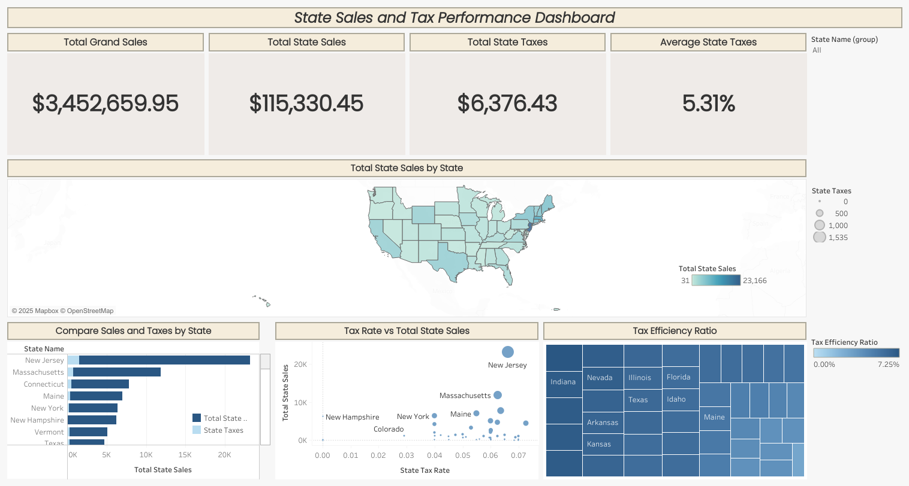

# Sales & Use Tax Analytics

This project automates the **Sales and Use Tax calculation process** and visualizes results using **Alteryx Designer** and **Tableau**.  
It was developed during my early weeks as an Analytics Engineer to streamline tax reporting, improve accuracy, and enhance audit visibility.

---

## 🚀 Overview
Manual tax reporting can lead to inconsistencies and slow turnaround times.  
This project builds an automated workflow to calculate sales and use taxes across states, apply jurisdiction-based rules, and create an interactive Tableau dashboard for better insights.

**Goals:**
- Automate Sales and Use Tax calculations
- Improve data accuracy and compliance
- Enable interactive visualization for decision-making

---

## ⚙️ Workflow (Alteryx)
- **Input & Preparation:** Combined multiple data sources (sales transactions, state tax rates, and ZIP mappings).  
- **Calculation Logic:** Applied regional tax rates and distinguished Sales Tax vs. Use Tax based on transaction type.  
- **Output:** Produced clean, aggregated summaries ready for Tableau visualization.

**File:** `alteryx/sales_use_tax_calculation.yxmd`

---

## 📊 Visualization (Tableau)
The Tableau dashboard presents:
- **Total Sales and Tax Amounts** across states  
- **Category-based tax breakdowns**  
- **Interactive filters** for exploring data by region or product type  
- **Key metrics** for compliance and audit tracking  

You can view the live interactive dashboard here:  
👉 [**View on Tableau Public**](https://public.tableau.com/app/profile/your_dashboard_link_here](https://public.tableau.com/views/my-workbook_17599991638810/StateSalesandTaxPerformanceDashboard?:language=en-US&:sid=&:redirect=auth&:display_count=n&:origin=viz_share_link))

**File:** `tableau/sales_use_tax_dashboard.twb`

[

---

## 💡 Key Insights
- Identified states with higher Use Tax due to inter-state transactions  
- Highlighted under-reported categories needing audit attention  
- Reduced manual tax reporting time by approximately **70%**

---

## 🧰 Tools & Skills
- **Alteryx Designer** – ETL automation, workflow design, data transformation  
- **Tableau** – Interactive dashboarding and storytelling  
- **Excel / CSV** – Data validation and lookup reference handling  

---

## 📁 Repository Structure
```plaintext
sales-use-tax-analytics/
│
├── alteryx/
│   └── sales_use_tax_calculation.yxmd
│
├── tableau/
│   └── sales_use_tax_dashboard.twb
│
├── data/
│   ├── input/
│   │   ├── state_tax_rates.csv
│   │   ├── subscription_data.csv
│   │   └── zip_code_by_state.csv
│   │
│   └── output/
│       └── output_summary.csv
│
├── images/
│   └── dashboard_preview.png
│
└── README.md
